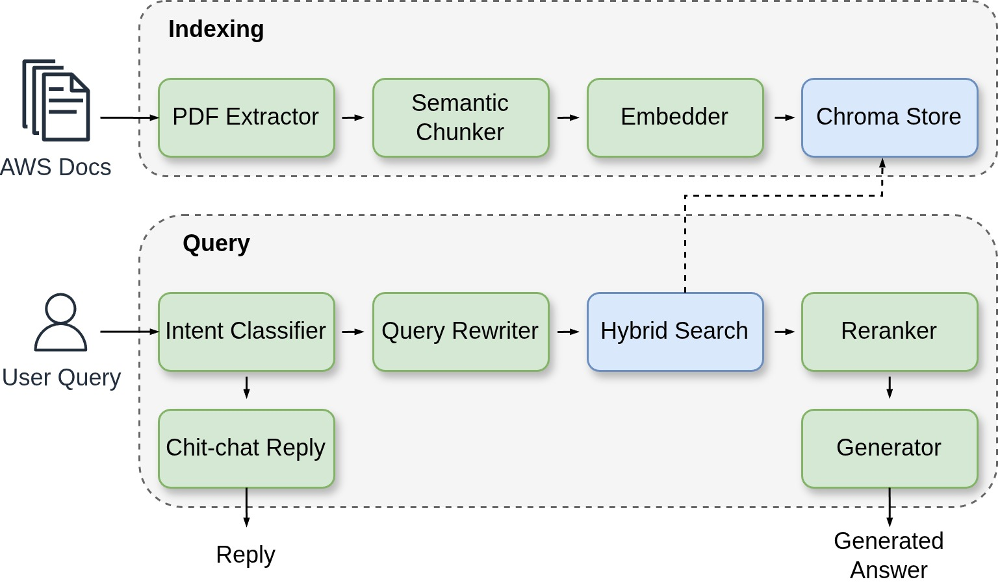

# AWS Documentation Assistant

A local, fully offline Retrieval-Augmented Generation (RAG) assistant that answers questions about AWS services directly from the official documentation. It runs entirely on local hardware using open-source models for embedding, reranking, and generation.

Ask it about service prefixes, IAM permissions, ARN formats, CLI commands, or how a service works, and it returns a grounded, cited answer drawn from the source documentation, with the exact page references shown beneath each response.



## Highlights

- **Grounded and cited.** Every answer is synthesised only from retrieved documentation, with inline citations and source page numbers.
- **Hybrid retrieval with reranking.** Combines dense semantic search and BM25 keyword search, then reorders results with a cross-encoder reranker for high-precision context.
- **Query decomposition.** Comparison and multi-part questions are automatically broken into sub-queries, retrieved independently, and synthesised.
- **Multi-turn conversation.** Follow-up questions resolve references against history ("what about its ARN?") through a history-aware query rewriter.
- **Streaming responses.** Tokens stream to the UI in real time over Server-Sent Events.
- **Fully local.** Embeddings, reranker, and LLM all run on-device through Ollama and Hugging Face — private and offline.
- **Evaluated.** Retrieval and answer quality are measured with RAGAS against a hand-built golden question set.

## Coverage

The assistant currently indexes 12 AWS service guides:

`IAM` · `SageMaker` · `Bedrock` · `S3` · `Lambda` · `Glue` · `EC2` · `VPC` · `CloudFormation` · `Comprehend` · `Rekognition` · `Textract`

## Architecture

The system has two phases: an offline **indexing** phase that prepares the documentation, and a runtime **query** phase that answers questions.

### Indexing

| Stage | Component | Role |
|-------|-----------|------|
| Extract | `pymupdf4llm` + custom cleanup | Extracts text from PDF guides, repairs ligatures and broken tables, strips repeated headers and footers |
| Chunk | LlamaIndex `SemanticSplitterNodeParser` | Splits text on semantic boundaries (bge-small), merges undersized fragments |
| Embed | `BAAI/bge-base-en-v1.5` | Encodes chunks into dense vectors on GPU |
| Store | Chroma | Persists the vector index for retrieval |

### Query

| Stage | Component | Role |
|-------|-----------|------|
| Intent | LLM classifier | Routes greetings/small-talk away from retrieval |
| Rewrite | History-aware rewriter + decomposer | Resolves follow-up references, splits comparison questions into sub-queries |
| Retrieve | Hybrid search (dense + BM25) | Pulls candidate chunks from the vector store and keyword index |
| Rerank | `BAAI/bge-reranker-v2-m3` cross-encoder | Reorders candidates and keeps the top 5 |
| Generate | `qwen3:14b` (Ollama) | Produces a grounded, cited answer from the reranked context |

## Stack

- **Retrieval:** LangChain, Chroma, BM25, Hugging Face embeddings + cross-encoder
- **Generation:** Ollama (`qwen3:14b`), local
- **Backend:** FastAPI with Server-Sent Events streaming
- **Frontend:** React + Vite
- **Evaluation:** RAGAS

## Evaluation

Measured with RAGAS over a hand-built golden set of 52 questions spanning prefix lookups, permission tables, ARN formats, CLI how-tos, and conceptual questions across all 12 services.

| Metric | Score |
|--------|-------|
| Context recall | 0.89 |
| Context precision | 0.80 |
| Faithfulness | 0.88 |
| Answer relevancy | 0.92 |

Faithfulness measures how well answers stay grounded in retrieved evidence; the high score confirms the system reasons over its sources rather than hallucinating.

## Getting started

### Prerequisites

- Python 3.10
- An NVIDIA GPU (the reference build uses a 16 GB card)
- [Ollama](https://ollama.com) with the generation model pulled:
  ```bash
  ollama pull qwen3:14b
  ```

### Setup

```bash
git clone https://github.com/EyadAlgha/aws-doc-assistant.git
cd aws-doc-assistant

# install Python dependencies
pip install -r requirements.txt

# place the AWS PDF guides in data/, then build the chunk files
python semantic_chunker.py
```

On first launch the vector store is built and persisted automatically; subsequent launches load it directly.

### Run

Backend:
```bash
uvicorn api:app --port 8000
```

Frontend:
```bash
cd aws-ui
npm install
npm run dev
```

Open the printed local URL (default `http://localhost:5173`).

## Project layout

```
.
├── pdf_loader.py          # PDF extraction and cleanup
├── semantic_chunker.py    # semantic chunking and chunk-file generation
├── rag.py                 # retrieval, reranking, query handling, generation
├── api.py                 # FastAPI server with SSE streaming
├── eval.py                # RAGAS evaluation harness
├── prompts/               # externalised prompt files
├── eval/
│   ├── golden_set.json    # evaluation question set
├── aws-ui/                # React + Vite frontend
├── output/                # generated chunk files
└── data/                  # source AWS PDF guides
```

## License

MIT © Eyad Alghamdi